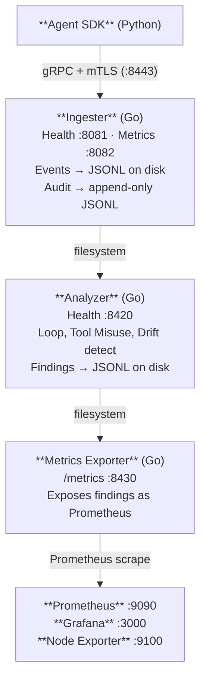

# Agent Transponder

**Black box telemetry and failure detection for AI agents. Security-first.**

Agent Transponder is an observability and safety platform that captures detailed telemetry from AI agent systems to detect failures, drift, unsafe behaviors, and emergent patterns. Inspired by aviation flight recorders, it provides tamper-evident recording, real-time analysis, and production-grade monitoring for any LLM-backed agent.

The v0.1.0 PoC is functional and deployed via Ansible.

## Features

- **Structured telemetry capture** — prompts, responses, tool calls, memory operations, reasoning traces, errors, and token usage
- **Failure detection** — task loops, tool misuse, goal drift, hallucination indicators, failure cascades
- **Tamper-evident audit trail** — SHA-256 hash-chained audit log with integrity verification
- **Encryption at rest** — AES-256-GCM envelope encryption with crypto-shredding for secure deletion
- **mTLS everywhere** — mutual TLS on all service boundaries, TLS 1.3 minimum
- **PII/secret redaction** — regex-based scrubbing at ingestion time (before persistence)
- **Prometheus metrics** — cardinality-bounded, aggregate-only (no PII in labels)
- **Signed supply chain** — cosign image signing, SBOM generation (SPDX + CycloneDX), vulnerability scanning

## Architecture



## Port Reference

| Service          | Port | Protocol  | Purpose                      |
|------------------|------|-----------|------------------------------|
| Ingester         | 8443 | gRPC+mTLS | Agent event submission       |
| Ingester         | 8081 | HTTP      | Health check                 |
| Ingester         | 8082 | HTTP      | Internal metrics             |
| Analyzer         | 8420 | HTTPS     | Health + API                 |
| Metrics Exporter | 8430 | HTTPS     | Prometheus metrics           |
| Prometheus       | 9090 | HTTPS     | Monitoring                   |
| Grafana          | 3000 | HTTPS     | Dashboards                   |
| Node Exporter    | 9100 | HTTP      | System metrics               |

## Quick Start

```bash
# Install Ansible dependencies
make ansible-deps

# Build Go binaries
make build-all

# Deploy to localhost (dev mode, hardening disabled)
make ansible-local

# Run smoke test
make smoke-test

# Open Grafana
# https://localhost:3000 (default: admin/admin)
```

## LangChain Integration

Agent Transponder includes a LangChain callback handler that automatically captures telemetry from LangChain agents.

### Installation

```bash
pip install -e sdk/[langchain]
```

### Usage

```python
from agent_transponder import Transponder
from agent_transponder.integrations.langchain import TransponderCallbackHandler

tp = Transponder(
    endpoint="localhost:8443",
    ca_cert="/etc/flight-recorder/tls/ca/ca.crt",
    client_cert="/etc/flight-recorder/tls/sdk/cert.pem",
    client_key="/etc/flight-recorder/tls/sdk/key.pem",
    hmac_key=b"your-hmac-key",
    agent_id="sdk-demo",
    tenant_id="my-team",
)

with tp.session() as session:
    handler = TransponderCallbackHandler(session)
    # Pass handler to any LangChain invocation
    chain.invoke({"input": "..."}, config={"callbacks": [handler]})
```

### Demo

```bash
PYTHONPATH=. python examples/langchain_demo.py --verbose
```

See [examples/README.md](examples/README.md) for full usage.

## Ansible Roles

| Role             | Purpose                                                    |
|------------------|------------------------------------------------------------|
| common           | OS preflight, packages, users, directories                 |
| hardening        | Kernel parameters, sysctl, SSH hardening (disabled in dev) |
| tls              | Self-signed CA + per-service certificates                  |
| prometheus       | Prometheus installation and configuration                  |
| grafana          | Grafana installation, datasources, dashboards              |
| node_exporter    | Node Exporter for system metrics                           |
| ingester         | Go ingestion API service (gRPC on :8443)                   |
| analyzer         | Go analysis engine (findings detection)                    |
| metrics_exporter | Go Prometheus metrics exporter (:8430)                     |

## Makefile Targets

| Target           | Description                                                |
|------------------|------------------------------------------------------------|
| `ansible-deps`   | Install Ansible collections (community.crypto, posix)     |
| `ansible-local`  | Deploy to localhost (dev bootstrap, hardening disabled)    |
| `ansible-deploy` | Deploy to inventory (ENV=dev\|staging\|production)         |
| `ansible-lint`   | Lint all Ansible roles and playbooks                       |
| `ansible-check`  | Dry-run site.yml with --check --diff                       |
| `ansible-vault-edit` | Edit encrypted vault file                             |
| `build-all`      | Build all Go binaries to dist/                             |
| `smoke-test`     | Run end-to-end smoke test                                  |

## Validation

```bash
# Check all services are up
for svc in ingester analyzer metrics-exporter prometheus grafana prometheus-node-exporter; do
  systemctl is-active flight-recorder-$svc 2>/dev/null || systemctl is-active $svc
done

# Check listening ports
ss -tlnp | grep -E '8443|8081|8082|8420|8430|9090|3000|9100'

# Check TLS (adjust CA path)
CA=/etc/flight-recorder/tls/ca/ca.crt
sudo curl -s --cacert $CA https://localhost:8430/metrics | head -5
sudo curl -s --cacert $CA https://localhost:9090/api/v1/query?query=up | jq .

# Run smoke test
make smoke-test
```

## Project Structure

```
cmd/
  ingestion/        Go ingestion API server (gRPC :8443)
  analyzer/         Go analysis engine entry point
  exporter/         Go Prometheus metrics exporter (:8430)
internal/
  types/            Canonical event schema
  eventstore/       EventStore interface + JSONL implementation
  audit/            AuditSink interface + hash-chain implementation
  identity/         IdentityProvider interface + mTLS implementation
  keymanager/       KeyManager interface + local encryption implementation
  policy/           PolicyEngine interface + config-based implementation
  redaction/        Redactor interface + regex implementation
  metrics/          Prometheus metric definitions
  analyzer/         Analysis engine logic (loop, drift, tool-misuse detectors)
proto/agenttransponder/v1/
  events.proto      SDK → Ingestion gRPC service contract
  analysis.proto    Ingestion → Analysis gRPC service contract
sdk/                Python SDK for agent instrumentation (active)
archive/
  analysis-python/  Original Python analysis engine (reference only)
  test_e2e.py       Original Docker-era e2e test (replaced by smoke-test.yml)
ansible/            Ansible roles + playbooks for all deployment targets
config/             Runtime configuration files
deploy/             Docker deployment configs (secondary for v0.1.0)
scripts/            Certificate generation and helper scripts
```

## v1.0.0 Architecture (Target)

Distributed Kubernetes deployment with full zero trust. Same interfaces,
production-grade implementations behind them.

| Interface           | v0.1.0                           | v1.0.0                               |
|---------------------|----------------------------------|--------------------------------------|
| `EventStore`        | Append-only JSONL on local disk  | Kafka topics + S3 persistence        |
| `IdentityProvider`  | Self-signed CA, static certs     | SPIFFE/SPIRE, short-lived SVIDs      |
| `KeyManager`        | Local keyfile, per-bucket DEKs   | Vault / Cloud KMS, auto-rotation     |
| `AuditSink`         | SHA-256 hash chain               | Merkle tree + Rekor transparency log |
| `PolicyEngine`      | YAML config, token bucket        | OPA sidecar, Rego policies           |
| `AnalysisRunner`    | Single worker, filesystem I/O    | K8s Jobs, consumer groups, HPA       |

## Roadmap

### Phase 2d — Testing and CI
- Molecule tests for each Ansible role
- Hardening verification (OpenSCAP)
- CI pipeline: lint → molecule → integration
- Go gRPC smoke test tool for full pipeline validation

### Phase 3a — Package Build Pipeline
- nfpm packaging for all Go services (.deb, .rpm, .tar.zst)
- nfpm repackaging of Prometheus, Grafana, node_exporter
- GPG signing of all packages (Ed25519)
- CI pipeline: build → package → sign → publish

### Phase 3b — Repository Infrastructure
- Nexus repository manager Ansible role
- Hosted apt, yum, and pacman repositories
- GPG public key distribution via common role
- All install roles refactored to use internal repo

### Phase 3c — Upstream Tracking
- Automated upstream release watcher
- Rebuild + republish pipeline on new versions
- Security advisory monitoring

### Future
- Loki role for centralized log aggregation
- Deep analyzer (Python/ML) as a second-tier analysis service
- Behavioral clustering and activation sampling
- Event replay system
- Dynamic inventory (cloud provider, Consul)
- step-ca / ACME for external TLS

## Security

See [SECURITY.md](SECURITY.md) for the full security policy, vulnerability reporting process, and supply chain verification instructions.

### Supply Chain Verification

```bash
# Verify image signature
cosign verify ghcr.io/<owner>/agent-transponder/ingestion:<tag> \
  --certificate-identity-regexp=".*" \
  --certificate-oidc-issuer-regexp=".*"

# Verify SBOM attestation
cosign verify-attestation ghcr.io/<owner>/agent-transponder/ingestion:<tag> \
  --type spdxjson
```

## License

[TBD]
